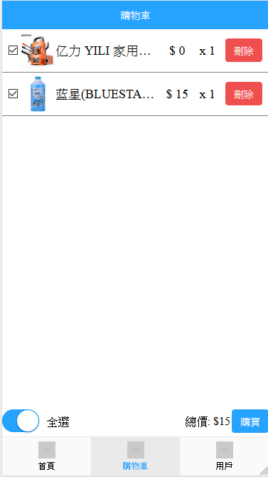

	A mobile app use `vue` + `vue router` +`vuex` + `axios` + `Mint UI` to build up the mobile web application, backend is using `express`+ `MySQL`. 

## Project setup
```
npm install
```

### Compiles and hot-reloads for development
```
npm run serve
```

##backend
https://github.com/wong2444/vue_mall_backend

##screen shot



